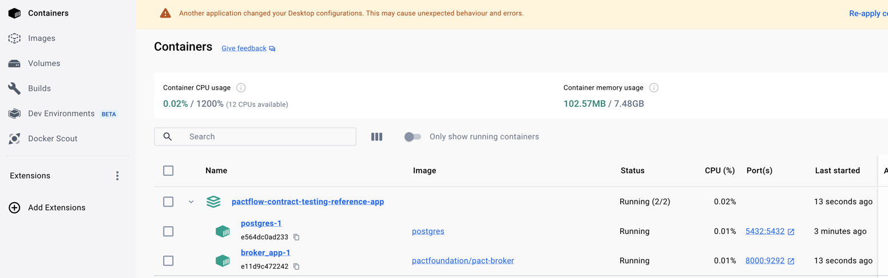
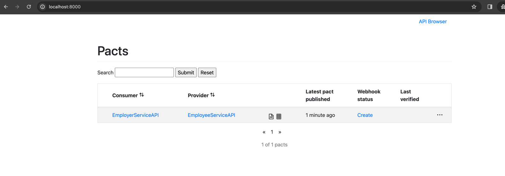
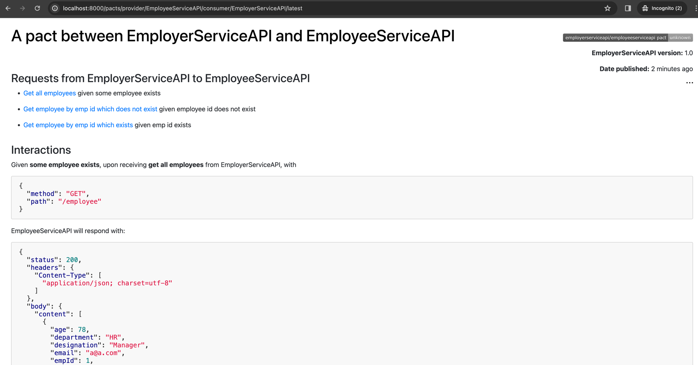

## Consumer & producer app with pact flow:

### How to upload a contract to pactflow & test

- `docker-compose up` Start the pactflow 
  
- `mvn clean install` Create & publish the pact to the broker run 
  
- Click & verify the contract
  


### Lambda DSL

Different ways to configure the Body

```java
.body(newJsonArrayMinLike(1, array ->
    array.object(object -> {
        object.integerType("age");
        object.stringType("department");
        object.stringType("designation");
        object.stringType("email");
        object.integerType("empId");
        object.integerType("id");
        object.stringType("name");
        object.stringType("phone");
        object.stringType("salary");
    })).build())
```
Will Generate, random values
```text
[Employee(id=1386609266, empId=281998917, name=FaQPcd192W9OCqNyaDGa, age=1758585207, email=j5qiBTgbMcrTZJ4iVdwT, phone=MNPHbE9JGU15HvrJocPT, department=zI8cplOd54u9RnQxQDb6, salary=ZuuGFf83V0OI5TnINYrM, designation=hFxVi7svvP6pC1jcrhyI)]
```


```java
.body(newJsonArrayMinLike(1, array ->
    array.object(object -> {
        object.stringType("age", "78");
        object.stringType("department", "Development");
        object.stringType("designation", "Developer");
        object.stringType("email", "praveenr4u@gmail.com");
        object.stringType("empId", "435443");
        object.stringType("id", "123");
        object.stringType("name", "Praveen");
        object.stringType("phone", "342424");
        object.stringType("salary", "5000");
    })).build())
```
Will Generate, example values
```text
[Employee(id=123, empId=435443, name=Praveen, age=78, email=a@a.com, phone=342424, department=HR, salary=5000, designation=Manager)]
```

#### Usefull Links:
https://docs.pact.io/getting_started/matching

##
Sudo lsof -i:5432
Kill -9 <p_id>